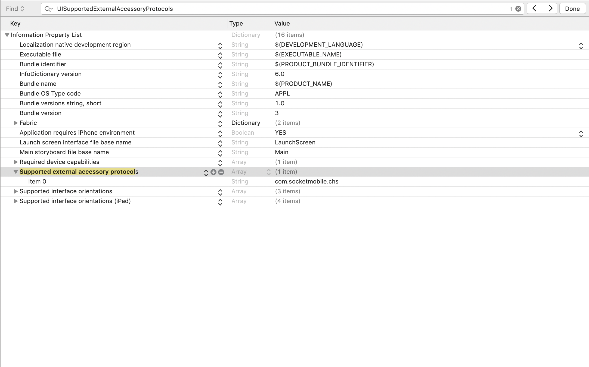

# over21-ios
A quick iOS app that reads the age from driver's licenses and identification cards to determine if someone is old enough to enter an establishment. 

Connect a Socket Mobile barcode scanner and scan the barcode on the back of a ID card.

<p float="left">
  
   
  
   
  
  
</p>


## IMPORTANT
At the moment, this has only been tested with New York State issued ID cards.

When using/installing CocoaPods in a new project, the project workspace file should be used instead of the project file.

The Socket Mobile Bluetooth barcode scanners and RFID Readers use the External Accessory Framework.

It is very important to make sure your application info plist file contains the key: `UISupportedExternalAccessoryProtocols` with array item: `com.socketmobile.chs`.


The previous version of iOS used to give an error message in the traces when a barcode scanner connects to the iOS device and the protocol string was omitted, but that is no longer the case with the most recent version of iOS.

Adding the external accessory protocol string to your application will require your application to be whitelisted with Socket Mobile before submission to the App Store.

Make sure to contact Socket Mobile in order to whitelist your application.  You can submit your app to be whitelisted in the Socket Mobile Developer portal.

## Prerequisites
The Capture SDK uses CocoaPods. If it needs to be installed, please check the [CocoaPods website](https://cocoapods.org/ "CocoaPods Homepage") for the most current instructions.

The Socket Mobile Capture SDK is required in order to compile this sample.

## Documentation
The Capture SDK documentation can be found [here](https://docs.socketmobile.com/capture/ios/en/latest/swift.html "Capture SDK documentation").

## Installation
The following steps show how to get and build this project.

Open a Terminal window and clone the project:
`git clone https://github.com/SocketMobile/over21-ios.git && cd over21-ios`

Then install Socket Mobile Capture SDK:
`pod install`

Last, open the Over21 Xcode workspace file:
`open over21.xcworkspace`

It is important to load the Over21 workspace (NOT PROJECT) in Xcode and compile and run.

Build and run the application on a device in order to test with a Socket Mobile device.

## Remarks about Podfile
There are 2 Capture Cocoapods that is provided. For a Swift project it is better to use SKTCapture which has the CaptureHelper class written directly in Swift.

The second Capture CocoaPods, SKTCaptureObjC has CaptureHelper written in Objective-C.

### using use_frameworks!
In this configuration the source files using Capture should include a
`import SKTCapture` at the beginning of the source file.
There is no need of a Bridging Header file.
Here is an example of such Podfile:
```
# Uncomment the next line to define a global platform for your project
# platform :ios, '9.0'

target 'Over21' do
  # Comment the next line if you're not using Swift and don't want to use dynamic frameworks
  use_frameworks!

  # Pods for Over21

pod 'SKTCapture'

end

```

The source file using CaptureHelper could look like this:
```
import UIKit
import SKTCapture

class ViewController: UIViewController,
  CaptureHelperDevicePresenceDelegate,
  CaptureHelperDeviceDecodedDataDelegate {
  
    let noScannerConnected = "No scanner connected"
    var scanners : [NSString] = []  // keep a list of scanners to display in the status
    var softScanner : CaptureHelperDevice?  // keep a reference on the SoftScan Scanner

...
```

## IMPORTANT NOTES
In Xcode the debug information format in the build options is set by default to
'DWARF with DSYM file'. This is causing numerous warnings. It is recommended to
set it back to 'DWARF' instead.


## ABOUT
Founded in 1992, Socket Mobile is a leading provider of data capture and delivery solutions for
enhanced productivity in workforce mobilization. Socket Mobile’s revenue is primarily driven by
the deployment of third party barcode enabled mobile applications that integrate Socket Mobile’s
cordless barcode scanners and contactless reader/writers. Mobile Applications servicing the specialty
retailer, field service, transportation, and manufacturing markets are the primary revenue drivers.
Socket Mobile has a network of thousands of developers who use its software developer tools to add
sophisticated data capture to their mobile applications. Socket Mobile is headquartered in Newark, Calif.
